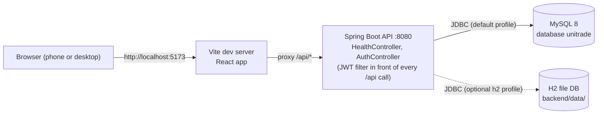
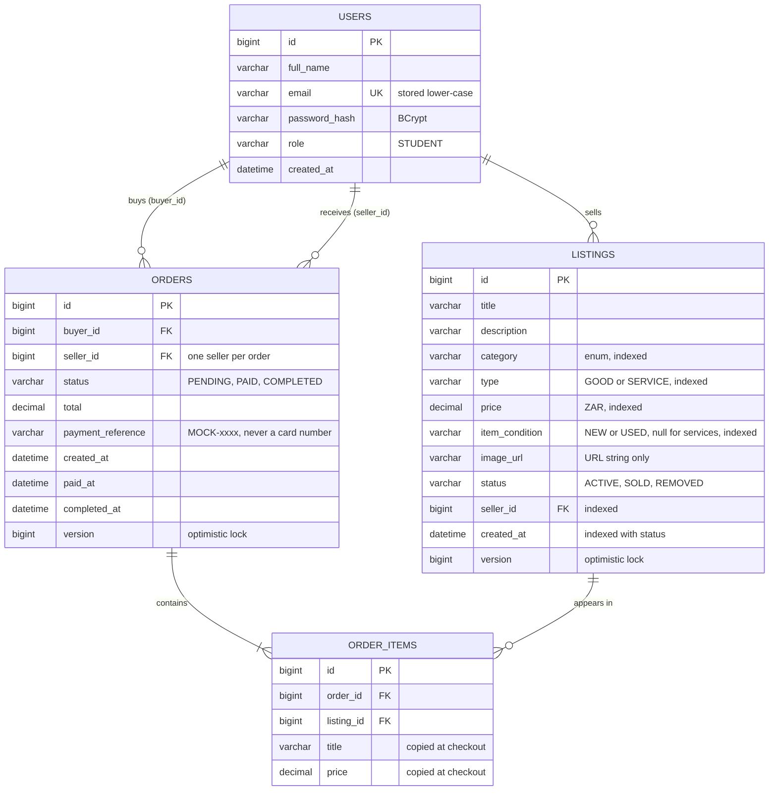
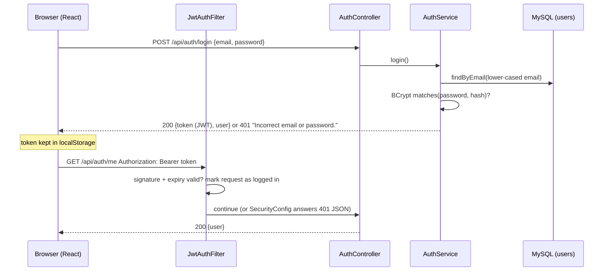

# UniTrade — Evidence File

> Single source of evidence for the PRM372S portfolio (Final Report, Quality Plan, Risk Plan, Transition & Closure Plan, Reflection, Resource Plan) and for the video demo.
> **Rules:** (1) Only record things that really happened. (2) Test results come from real test runs: `node scripts/test-report.mjs` (automated) or are entered by Collins after he executes them (manual). (3) Anything not yet done is marked `NOT RUN` / `NOT BUILT`, never filled in.
> Sections 2 and 3 contain machine-written blocks between `<!-- ...:START -->` and `<!-- ...:END -->` markers. **Do not edit inside those markers by hand.**

**Project:** Community Store Mobile-First Marketplace (UniTrade) · **Course:** PRM372S · **Student:** Collins (230093183)
**Scope decision:** Student-only marketplace (see Decision Log D1).

---

## 1. Requirements traceability and success-criteria scorecard
Maintained by Claude Code at the end of every slice. `Status` is one of: NOT BUILT · IN PROGRESS · BUILT · BUILT + TESTED. Test status is taken from Section 2, not assumed.

| ID | Requirement (short) | Priority tier | Slice | Status | Evidence (tests / manual test IDs / screenshots) | Met? (Yes / Partly / No / Not yet assessed) |
|---|---|---|---|---|---|---|
| FR1 | Student registration/login, `@mycput.ac.za` only, hashed passwords, JWT | Tier 1 | 1 | BUILT + TESTED | Automated: backend `Fr1AuthTest` (11: non-student and look-alike domains rejected, BCrypt hash stored, duplicate email 409, short password, wrong password and unknown email give the same 401, protected endpoint 401 without / garbage / forged / expired token, JSON error bodies), `Fr1EmailPolicyTest` (2); frontend `Fr1Auth.test.jsx` (9). Checked by hand against MySQL on 2026-10-08 with curl (see slice log). Manual UI tests M1-01…M1-05 are `NOT RUN`. | Partly (manual UI tests not run yet) |
| FR2 | Create/edit/delete listings (goods and services), owner-only | Tier 1 | 2 | BUILT + TESTED | Automated: backend `Fr2ListingsTest` (14: login required, all fields stored, title/price/category validation, price 0 allowed, condition rule for goods/services, image link must be http(s), public view + 404, owner edit, non-owner 403 with data unchanged, soft delete, my listings, sold listing locked, bad enum → 400); frontend `Fr2Listings.test.jsx` (10). Checked by hand against MySQL on 2026-10-08 (all 6 listing indexes created; 403 for a non-owner). Manual UI tests M2-01…M2-04 are `NOT RUN`. | Partly (manual UI tests not run yet) |
| FR3 | Search + filter (keyword, category, price range, condition) | Tier 1 | 3 | BUILT + TESTED | Automated: backend `Fr3SearchTest` (10: only ACTIVE listings, public access, keyword in title or description ignoring case, `%` and `_` matched literally, category/type/condition filters, inclusive price range with either end optional, combined filters, paging newest first with our own page shape, empty result = 200, bad parameters = 400, SQL-injection text is only text); frontend `Fr3Search.test.jsx` (8). Checked by hand against MySQL on 2026-10-08; `EXPLAIN` shows the category index is used. Six indexes on the filtered columns. Speed under load is NFR2 (Slice 7), not measured yet. Manual UI tests M3-01…M3-03 are `NOT RUN`. | Partly (manual UI tests not run yet; performance not measured) |
| FR4 | Cart, checkout, payment via mock gateway, order lifecycle | Tier 1 | 4 | BUILT + TESTED | Automated: backend `Fr4OrdersTest` (15: login required, order built from database prices, own listing refused, empty/unknown/duplicate/two-seller carts refused, removed listing refused, approved payment → PAID + listing SOLD + gone from search, declined test card → 402 with nothing changed and retry on the same order, bad card number, no double payment, other student gets 403, second buyer gets 409 after the first paid, confirm receipt PAID → COMPLETED, my orders), `Fr4PaymentGatewayTest` (2), `Fr4RaceTest` (2 tests: two threads pay for the same listing in 8 rounds, exactly one succeeds each round); frontend `Fr4Cart.test.jsx` (11). **Mutation check 2026-10-08:** with the row lock and `@Version` temporarily removed, the race test fails in round 1 (`expected: <1> but was: <2>`, i.e. both buyers paid), so the test can detect the bug; protections restored and tests re-run green. Checked by hand against MySQL (decline 402, second buyer 409 "You have not been charged"). Manual UI tests M4-01…M4-05 are `NOT RUN`. | Partly (manual UI tests not run yet) |
| FR6 | Ratings and reviews after a completed order | Tier 1 | 5 | BUILT + TESTED | Automated: backend `Fr6ReviewsTest` (10: login required, no review before COMPLETED, buyer can review, one per order, the database's unique key refuses a second review even when the service check is bypassed, only the buyer may review, rating must be 1–5 and text ≤ 1000, seller average and count on the listing detail (5,4,4 → 4.3), public seller review list newest first, order shows its review); frontend `Fr6Reviews.test.jsx` (7) and `ErrorBoundary.test.jsx` (1). Verified live on MySQL after a clean reset: the seeded completed order shows Ayesha 5.0 (1 review) and the sold chair stays out of search. Manual UI tests M5-01…M5-03 are `NOT RUN`. | Partly (manual UI tests not run yet) |
| FR5 | Community bulletin board | Tier 2 | 6 | BUILT + TESTED | Automated: backend `Fr5BulletinTest` (9: posting needs login, post stored with trimmed text and author shown by name only, public list newest first with category filter, paging, validation incl. bad category, author deletes own post, other student gets 403 and anonymous 401, unknown post 404, single post readable publicly); frontend `Fr5Bulletin.test.jsx` (7). Checked live on MySQL (4 seeded posts, EVENT filter, 403 for a non-author, 204 for the author). Manual UI tests M6-01…M6-03 are `NOT RUN`. | Partly (manual UI tests not run yet) |
| NFR1 | Security (hashing, JWT, validation, no secrets in repo) | Tier 1 | all | IN PROGRESS | Slice 0: DB credentials only via env vars / git-ignored `application-local.properties`; CORS restricted to configured origins (manual curl check 2026-10-08: unlisted origin 403). Production profile: automated `nfr1_01` (only the deployed site allowed), `nfr1_02` (missing secrets named, start refused). Slice 1: BCrypt hashes (`$2a$10$…` seen in MySQL), JWT-protected endpoints (401 JSON without a valid token, tests `fr1_09`/`fr1_10`), password hash never returned by the API, JPA only (no hand-written SQL), CSRF off by design for a stateless token API (D14). | Not yet assessed |
| NFR2a | Redis caching of search | Tier 2 | 7 | NOT BUILT | | Not yet assessed |
| NFR2b | Search p95 < 2 s under load (see Section 3) | Tier 2 | 7 | NOT BUILT | | Not yet assessed |
| NFR2c | Microservices architecture | Tier 3 (stretch) | 8 | NOT BUILT | | Not yet assessed |
| NFR3 | Mobile-first responsive UI | Tier 1 | all | IN PROGRESS | Slice 0: mobile-first stylesheet (44 px touch targets), shared loading/empty/error views; automated `slice0_02` (friendly error instead of blank screen), `slice0_03` (not-found page) | Not yet assessed |

**Success criteria (used in the Transition & Closure Plan):**
1. All Tier 1 requirements are BUILT + TESTED and their automated tests pass.
2. Zero open critical defects in Section 8 at submission.
3. Search p95 < 2000 ms with zero errors at 50 concurrent users on the performance dataset.
4. The full demo flow (Section 10) runs end to end without errors on a clean machine using the README steps.

| Criterion | Result | Evidence |
|---|---|---|
| 1 | Not yet assessed | |
| 2 | Not yet assessed | |
| 3 | Not yet assessed | |
| 4 | Not yet assessed | |

---

## 2. Test report
### 2.1 Automated tests (JUnit / Vitest)
Generated by `node scripts/test-report.mjs` from real result files. Naming convention: put the requirement ID in the test name, e.g. `fr1_01_registerRejectsNonStudentEmail`, so results can be grouped by requirement.

<!-- TEST-REPORT:START -->
**Generated:** 2026-10-09 14:49:38 UTC · **Machine:** linux 6.17.0-14-generic · **Node:** v24.21.0

**Result files read:** 12 (backend/target/surefire-reports, frontend/test-results)

| Total tests | Passed | Failed | Skipped | Pass rate | Total time |
|---|---|---|---|---|---|
| 137 | 137 | 0 | 0 | 100.0% | 37.73 s |

### Results by requirement

| Requirement | Tests | Passed | Failed | Skipped |
|---|---|---|---|---|
| FR1 | 22 | 22 | 0 | 0 |
| FR2 | 24 | 24 | 0 | 0 |
| FR3 | 18 | 18 | 0 | 0 |
| FR4 | 30 | 30 | 0 | 0 |
| FR5 | 16 | 16 | 0 | 0 |
| FR6 | 17 | 17 | 0 | 0 |
| NFR1 | 2 | 2 | 0 | 0 |
| NFR3 | 3 | 3 | 0 | 0 |
| Unmapped (no FR/NFR id in name) | 5 | 5 | 0 | 0 |

### All automated test cases

| Req | Test | Class | Result | Time (s) |
|---|---|---|---|---|
| — | Slice 0 - app shell > slice0_01 shows the API and database status from /api/health (page /status) | src/App.test.jsx | PASS | 0.342 |
| — | Slice 0 - app shell > slice0_02 shows a friendly error (not a blank screen) when the server is unreachable | src/App.test.jsx | PASS | 0.072 |
| — | Slice 0 - app shell > slice0_03 shows a not-found page for unknown routes | src/App.test.jsx | PASS | 0.037 |
| — | Slice 0 - app shell > slice0_04 shows an error instead of loading forever when the answer is not from the API (HTML page) | src/App.test.jsx | PASS | 0.058 |
| — | slice0_01_healthEndpointReportsApiAndDatabaseUp | Slice0HealthTest | PASS | 0.012 |
| FR1 | FR1 - authentication screens > fr1_01 register shows the server message under the email field for a non-student email | src/auth/Fr1Auth.test.jsx | PASS | 1.110 |
| FR1 | FR1 - authentication screens > fr1_02 register with valid details logs the student in and keeps the token | src/auth/Fr1Auth.test.jsx | PASS | 0.981 |
| FR1 | FR1 - authentication screens > fr1_03 register checks the password length in the browser without calling the server | src/auth/Fr1Auth.test.jsx | PASS | 0.449 |
| FR1 | FR1 - authentication screens > fr1_04 login shows a friendly message for a wrong password and stays on the page | src/auth/Fr1Auth.test.jsx | PASS | 0.329 |
| FR1 | FR1 - authentication screens > fr1_05 login shows an error instead of a blank screen when the server is unreachable | src/auth/Fr1Auth.test.jsx | PASS | 0.196 |
| FR1 | FR1 - authentication screens > fr1_06 a protected page sends a logged-out visitor to login, then returns them after login | src/auth/Fr1Auth.test.jsx | PASS | 0.225 |
| FR1 | FR1 - authentication screens > fr1_07 a stored token that the server rejects (401) is discarded and the visitor is logged out | src/auth/Fr1Auth.test.jsx | PASS | 0.023 |
| FR1 | FR1 - authentication screens > fr1_08 a valid stored token restores the session after a refresh, and Log out clears it | src/auth/Fr1Auth.test.jsx | PASS | 0.075 |
| FR1 | FR1 - authentication screens > fr1_09 the password can be shown and hidden | src/auth/Fr1Auth.test.jsx | PASS | 0.045 |
| FR1 | fr1_01_registerRejectsNonStudentEmail | Fr1AuthTest | PASS | 0.012 |
| FR1 | fr1_02_registerRejectsLookalikeDomain | Fr1AuthTest | PASS | 0.020 |
| FR1 | fr1_03_registerStoresBcryptHashNormalisedEmailAndReturnsToken | Fr1AuthTest | PASS | 0.123 |
| FR1 | fr1_04_registerRejectsShortPassword | Fr1AuthTest | PASS | 0.014 |
| FR1 | fr1_05_registerRejectsMissingFields | Fr1AuthTest | PASS | 0.011 |
| FR1 | fr1_06_registerRejectsDuplicateEmailIgnoringCase | Fr1AuthTest | PASS | 0.123 |
| FR1 | fr1_07_loginReturnsJwtThatUnlocksProtectedEndpoint | Fr1AuthTest | PASS | 0.262 |
| FR1 | fr1_08_loginRejectsWrongPasswordAndUnknownEmailWithTheSameMessage | Fr1AuthTest | PASS | 0.232 |
| FR1 | fr1_09_protectedEndpointWithoutTokenIs401WithJsonBody | Fr1AuthTest | PASS | 0.009 |
| FR1 | fr1_10_protectedEndpointRejectsGarbageForgedAndExpiredTokens | Fr1AuthTest | PASS | 0.148 |
| FR1 | fr1_11_malformedJsonAndUnknownUrlGiveJsonErrorsNotHtmlOrStackTraces | Fr1AuthTest | PASS | 0.128 |
| FR1 | fr1_12_acceptsStudentAddressesIgnoringCaseAndSpaces | Fr1EmailPolicyTest | PASS | 0.001 |
| FR1 | fr1_13_rejectsEverythingElse | Fr1EmailPolicyTest | PASS | 0.028 |
| FR2 | FR2 - listing screens > fr2_01 My listings shows a friendly empty state with a Sell button | src/pages/Fr2Listings.test.jsx | PASS | 0.317 |
| FR2 | FR2 - listing screens > fr2_02 My listings shows each listing with its price and a SOLD badge | src/pages/Fr2Listings.test.jsx | PASS | 0.078 |
| FR2 | FR2 - listing screens > fr2_03 the form checks title, category and price in the browser without calling the server | src/pages/Fr2Listings.test.jsx | PASS | 0.309 |
| FR2 | FR2 - listing screens > fr2_04 creating a service sends no condition and opens the new listing | src/pages/Fr2Listings.test.jsx | PASS | 0.794 |
| FR2 | FR2 - listing screens > fr2_05 a server validation message is shown under the field it belongs to | src/pages/Fr2Listings.test.jsx | PASS | 0.356 |
| FR2 | FR2 - listing screens > fr2_06 only the owner sees Edit and Delete on a listing | src/pages/Fr2Listings.test.jsx | PASS | 0.079 |
| FR2 | FR2 - listing screens > fr2_07 the owner can delete after confirming | src/pages/Fr2Listings.test.jsx | PASS | 0.183 |
| FR2 | FR2 - listing screens > fr2_08 a listing that does not exist shows a friendly message, not a blank screen | src/pages/Fr2Listings.test.jsx | PASS | 0.029 |
| FR2 | FR2 - listing screens > fr2_09 the edit form is filled with the current values | src/pages/Fr2Listings.test.jsx | PASS | 0.097 |
| FR2 | FR2 - listing screens > fr2_10 someone else's listing cannot be edited from the screen | src/pages/Fr2Listings.test.jsx | PASS | 0.032 |
| FR2 | fr2_01_createListingNeedsLogin | Fr2ListingsTest | PASS | 0.256 |
| FR2 | fr2_02_createStoresAllFieldsWithActiveStatusAndSeller | Fr2ListingsTest | PASS | 0.252 |
| FR2 | fr2_03_validationRejectsBlankTitleNegativePriceAndMissingFields | Fr2ListingsTest | PASS | 0.264 |
| FR2 | fr2_04_priceZeroIsAllowedButTooManyDecimalsIsNot | Fr2ListingsTest | PASS | 0.247 |
| FR2 | fr2_05_goodsNeedConditionAndServicesStoreNone | Fr2ListingsTest | PASS | 0.269 |
| FR2 | fr2_06_imageLinkMustBeHttpOrHttps | Fr2ListingsTest | PASS | 0.281 |
| FR2 | fr2_07_anyoneCanViewOneListingAndUnknownIdIs404 | Fr2ListingsTest | PASS | 0.281 |
| FR2 | fr2_08_ownerCanEditTheirListing | Fr2ListingsTest | PASS | 0.276 |
| FR2 | fr2_09_anotherStudentCannotEditOrDeleteGets403AndNothingChanges | Fr2ListingsTest | PASS | 0.300 |
| FR2 | fr2_10_editAndDeleteNeedLogin | Fr2ListingsTest | PASS | 0.270 |
| FR2 | fr2_11_ownerDeleteRemovesTheListingFromViewAndMyListings | Fr2ListingsTest | PASS | 0.360 |
| FR2 | fr2_12_myListingsShowsOnlyMyOwn | Fr2ListingsTest | PASS | 2.195 |
| FR2 | fr2_13_soldListingCannotBeEditedOrDeleted | Fr2ListingsTest | PASS | 0.281 |
| FR2 | fr2_14_invalidEnumValueGivesA400NotA500 | Fr2ListingsTest | PASS | 0.255 |
| FR3 | FR3 - browse, search and filter > fr3_01 the home page lists ACTIVE listings with their price and a count | src/pages/Fr3Search.test.jsx | PASS | 0.279 |
| FR3 | FR3 - browse, search and filter > fr3_02 searching sends the typed word to the API | src/pages/Fr3Search.test.jsx | PASS | 0.525 |
| FR3 | FR3 - browse, search and filter > fr3_03 category, type, condition and price filters are all sent to the API | src/pages/Fr3Search.test.jsx | PASS | 0.748 |
| FR3 | FR3 - browse, search and filter > fr3_04 a minimum price above the maximum is explained and nothing is searched | src/pages/Fr3Search.test.jsx | PASS | 0.343 |
| FR3 | FR3 - browse, search and filter > fr3_05 no matches shows a friendly empty state with a way to clear the filters | src/pages/Fr3Search.test.jsx | PASS | 0.298 |
| FR3 | FR3 - browse, search and filter > fr3_06 an unreachable server shows a message and Try again loads the listings | src/pages/Fr3Search.test.jsx | PASS | 0.162 |
| FR3 | FR3 - browse, search and filter > fr3_07 paging: Next asks for the following page and the position is shown | src/pages/Fr3Search.test.jsx | PASS | 0.169 |
| FR3 | FR3 - browse, search and filter > fr3_08 a search in the address bar is applied on load (shareable link) | src/pages/Fr3Search.test.jsx | PASS | 0.067 |
| FR3 | fr3_01_onlyActiveListingsAreReturnedAndNoLoginIsNeeded | Fr3SearchTest | PASS | 0.027 |
| FR3 | fr3_02_keywordMatchesTitleOrDescriptionIgnoringCase | Fr3SearchTest | PASS | 0.044 |
| FR3 | fr3_03_wildcardCharactersInTheKeywordAreMatchedLiterally | Fr3SearchTest | PASS | 0.032 |
| FR3 | fr3_04_filtersByCategoryTypeAndCondition | Fr3SearchTest | PASS | 0.076 |
| FR3 | fr3_05_priceRangeIsInclusiveAndEitherEndMayBeOmitted | Fr3SearchTest | PASS | 0.063 |
| FR3 | fr3_06_filtersCombine | Fr3SearchTest | PASS | 0.030 |
| FR3 | fr3_07_resultsArePagedNewestFirstWithOurOwnPageShape | Fr3SearchTest | PASS | 0.107 |
| FR3 | fr3_08_noMatchesIsAnEmptyListNotAnError | Fr3SearchTest | PASS | 0.054 |
| FR3 | fr3_09_badParametersGet400WithAMessage | Fr3SearchTest | PASS | 0.092 |
| FR3 | fr3_10_sqlInjectionTextIsJustText | Fr3SearchTest | PASS | 0.036 |
| FR4 | FR4 - cart, checkout and orders > fr4_01 Add to cart updates the header count and the cart page shows the item and total | src/pages/Fr4Cart.test.jsx | PASS | 0.659 |
| FR4 | FR4 - cart, checkout and orders > fr4_02 the owner cannot add their own listing and a logged-out visitor is asked to log in | src/pages/Fr4Cart.test.jsx | PASS | 0.195 |
| FR4 | FR4 - cart, checkout and orders > fr4_03 items from a second seller are refused with an explanation | src/pages/Fr4Cart.test.jsx | PASS | 0.109 |
| FR4 | FR4 - cart, checkout and orders > fr4_04 the cart survives a reload (localStorage), items can be removed, and an empty cart says so | src/pages/Fr4Cart.test.jsx | PASS | 0.201 |
| FR4 | FR4 - cart, checkout and orders > fr4_05 checkout creates the order from the ids only, pays it, clears the cart and shows the paid order | src/pages/Fr4Cart.test.jsx | PASS | 0.562 |
| FR4 | FR4 - cart, checkout and orders > fr4_06 a declined card shows the reason, keeps the cart, and a retry reuses the same order | src/pages/Fr4Cart.test.jsx | PASS | 0.588 |
| FR4 | FR4 - cart, checkout and orders > fr4_07 an item sold to someone else meanwhile is explained, with a link back to the cart | src/pages/Fr4Cart.test.jsx | PASS | 0.254 |
| FR4 | FR4 - cart, checkout and orders > fr4_08 checkout asks for a card number without calling the server | src/pages/Fr4Cart.test.jsx | PASS | 0.080 |
| FR4 | FR4 - cart, checkout and orders > fr4_09 the buyer confirms receipt and the order becomes Completed | src/pages/Fr4Cart.test.jsx | PASS | 0.099 |
| FR4 | FR4 - cart, checkout and orders > fr4_10 an unpaid order offers Continue to payment, and My orders shows empty and filled states | src/pages/Fr4Cart.test.jsx | PASS | 0.102 |
| FR4 | FR4 - cart, checkout and orders > fr4_11 another student's order shows the server message instead of a blank screen | src/pages/Fr4Cart.test.jsx | PASS | 0.023 |
| FR4 | fr4_01_checkoutNeedsLogin | Fr4OrdersTest | PASS | 0.351 |
| FR4 | fr4_02_checkoutCreatesPendingOrderWithPricesAndTotalFromTheDatabase | Fr4OrdersTest | PASS | 0.404 |
| FR4 | fr4_03_cannotBuyYourOwnListing | Fr4OrdersTest | PASS | 0.375 |
| FR4 | fr4_04_rejectsEmptyCartUnknownListingAndDuplicates | Fr4OrdersTest | PASS | 0.399 |
| FR4 | fr4_05_anOrderCanOnlyContainItemsFromOneSeller | Fr4OrdersTest | PASS | 0.363 |
| FR4 | fr4_06_removedListingsCannotBeOrdered | Fr4OrdersTest | PASS | 0.407 |
| FR4 | fr4_07_approvedPaymentMakesTheOrderPaidAndTheListingsSold | Fr4OrdersTest | PASS | 0.484 |
| FR4 | fr4_08_declinedCardGives402LeavesEverythingUnchangedAndAllowsARetry | Fr4OrdersTest | PASS | 0.472 |
| FR4 | fr4_09_invalidCardNumberIsRejectedBeforeAnyPayment | Fr4OrdersTest | PASS | 0.388 |
| FR4 | fr4_10_anOrderCannotBePaidTwice | Fr4OrdersTest | PASS | 0.375 |
| FR4 | fr4_11_onlyTheBuyerCanSeePayOrConfirmAnOrder | Fr4OrdersTest | PASS | 0.484 |
| FR4 | fr4_12_ifTwoBuyersOrderTheSameListingOnlyTheFirstToPaySucceeds | Fr4OrdersTest | PASS | 0.458 |
| FR4 | fr4_13_buyerConfirmsReceiptPaidToCompleted | Fr4OrdersTest | PASS | 0.451 |
| FR4 | fr4_14_myOrdersListsOnlyMyOrdersNewestFirst | Fr4OrdersTest | PASS | 0.567 |
| FR4 | fr4_15_aPaidListingCannotBeEditedOrDeletedByItsSeller | Fr4OrdersTest | PASS | 0.424 |
| FR4 | fr4_16_normalCardsAreApprovedWithAReference | Fr4PaymentGatewayTest | PASS | 0.002 |
| FR4 | fr4_17_theDocumentedTestCardIsDeclined | Fr4PaymentGatewayTest | PASS | 0.003 |
| FR4 | fr4_18_twoBuyersPayingForTheSameListingAtTheSameTimeOnlyOneSucceeds | Fr4RaceTest | PASS | 0.626 |
| FR4 | fr4_19_theRaceTestReallyUsesTwoThreads | Fr4RaceTest | PASS | 0.012 |
| FR5 | FR5 - bulletin board > fr5_01 anyone can read the board without logging in | src/pages/Fr5Bulletin.test.jsx | PASS | 0.261 |
| FR5 | FR5 - bulletin board > fr5_02 choosing a category asks the API for that category | src/pages/Fr5Bulletin.test.jsx | PASS | 0.451 |
| FR5 | FR5 - bulletin board > fr5_03 an empty board and a server problem both show a friendly message | src/pages/Fr5Bulletin.test.jsx | PASS | 0.087 |
| FR5 | FR5 - bulletin board > fr5_04 posting needs a login: a logged-out visitor is sent to the login page | src/pages/Fr5Bulletin.test.jsx | PASS | 0.060 |
| FR5 | FR5 - bulletin board > fr5_05 the post form checks title and text first, then publishes and opens the post | src/pages/Fr5Bulletin.test.jsx | PASS | 0.816 |
| FR5 | FR5 - bulletin board > fr5_06 only the author sees Delete, and deleting needs a confirmation | src/pages/Fr5Bulletin.test.jsx | PASS | 0.163 |
| FR5 | FR5 - bulletin board > fr5_07 another student does not see Delete, and an unknown post shows a friendly message | src/pages/Fr5Bulletin.test.jsx | PASS | 0.091 |
| FR5 | fr5_01_postingNeedsLogin | Fr5BulletinTest | PASS | 0.301 |
| FR5 | fr5_02_aStudentCanPostAndTheAuthorIsShownByNameOnly | Fr5BulletinTest | PASS | 0.294 |
| FR5 | fr5_03_theListIsPublicNewestFirstAndCanBeFilteredByCategory | Fr5BulletinTest | PASS | 0.317 |
| FR5 | fr5_04_theListIsPaged | Fr5BulletinTest | PASS | 0.287 |
| FR5 | fr5_05_validationRejectsMissingTitleBodyAndBadCategory | Fr5BulletinTest | PASS | 0.259 |
| FR5 | fr5_06_theAuthorCanDeleteTheirOwnPost | Fr5BulletinTest | PASS | 0.287 |
| FR5 | fr5_07_anotherStudentCannotDeleteItAndNeitherCanAnAnonymousVisitor | Fr5BulletinTest | PASS | 0.270 |
| FR5 | fr5_08_unknownPostIs404 | Fr5BulletinTest | PASS | 0.252 |
| FR5 | fr5_09_onePostCanBeReadPublicly | Fr5BulletinTest | PASS | 0.255 |
| FR6 | FR6 - reviews and seller ratings > fr6_01 a completed order offers a review form, and a missing rating is explained without calling the server | src/pages/Fr6Reviews.test.jsx | PASS | 0.527 |
| FR6 | FR6 - reviews and seller ratings > fr6_02 submitting a rating and text sends it and then shows the review instead of the form | src/pages/Fr6Reviews.test.jsx | PASS | 0.628 |
| FR6 | FR6 - reviews and seller ratings > fr6_03 the server message is shown when the order was already reviewed | src/pages/Fr6Reviews.test.jsx | PASS | 0.298 |
| FR6 | FR6 - reviews and seller ratings > fr6_04 an order that already has a review shows it and no form; an unfinished order has no review form | src/pages/Fr6Reviews.test.jsx | PASS | 0.164 |
| FR6 | FR6 - reviews and seller ratings > fr6_05 the listing page shows the seller's average rating and review count, or "No reviews yet" | src/pages/Fr6Reviews.test.jsx | PASS | 0.130 |
| FR6 | FR6 - reviews and seller ratings > fr6_06 the seller page lists the reviews with names, text and the average | src/pages/Fr6Reviews.test.jsx | PASS | 0.114 |
| FR6 | FR6 - reviews and seller ratings > fr6_07 My profile shows the reviews I received, and an unknown seller page shows a friendly message | src/pages/Fr6Reviews.test.jsx | PASS | 0.102 |
| FR6 | fr6_01_reviewNeedsLogin | Fr6ReviewsTest | PASS | 0.403 |
| FR6 | fr6_02_cannotReviewBeforeTheOrderIsCompleted | Fr6ReviewsTest | PASS | 0.418 |
| FR6 | fr6_03_buyerReviewsACompletedOrder | Fr6ReviewsTest | PASS | 0.431 |
| FR6 | fr6_04_onlyOneReviewPerOrder | Fr6ReviewsTest | PASS | 0.478 |
| FR6 | fr6_05_theDatabaseItselfRefusesASecondReviewForTheSameOrder | Fr6ReviewsTest | PASS | 0.482 |
| FR6 | fr6_06_onlyTheBuyerCanReviewTheirOrder | Fr6ReviewsTest | PASS | 0.467 |
| FR6 | fr6_07_ratingMustBeAWholeNumberFromOneToFive | Fr6ReviewsTest | PASS | 0.424 |
| FR6 | fr6_08_sellerAverageRatingAndCountAppearOnTheListingDetail | Fr6ReviewsTest | PASS | 0.570 |
| FR6 | fr6_09_aSellersReviewsArePublicNewestFirstWithTheAverage | Fr6ReviewsTest | PASS | 0.537 |
| FR6 | fr6_10_theOrderShowsItsReviewAfterwards | Fr6ReviewsTest | PASS | 0.449 |
| NFR1 | nfr1_01_prodProfileAllowsTheDeployedSiteOnly | Nfr1ProdConfigTest | PASS | 0.015 |
| NFR1 | nfr1_02_productionStartNamesMissingSecrets | Nfr1ProdConfigTest | PASS | 0.008 |
| NFR3 | NFR3 - crash protection > nfr3_02 a screen that crashes while rendering shows a friendly message instead of a blank page | src/components/ErrorBoundary.test.jsx | PASS | 0.240 |
| NFR3 | NFR3 - loading state > nfr3_01 loading view explains a slow (waking) server instead of only spinning | src/components/StatusViews.test.jsx | PASS | 0.124 |
| NFR3 | Slice 0 - app shell > nfr3_03 a plain-text 500 from the dev proxy (API stopped) is shown as "cannot reach the server", not a generic error | src/App.test.jsx | PASS | 0.069 |

<!-- TEST-REPORT:END -->

### 2.2 Run history (shows how quality improved over time)
<!-- TEST-HISTORY:START -->
| Run (UTC) | Total | Passed | Failed | Skipped |
|---|---|---|---|---|
| 2026-10-08 18:01:02 UTC | 4 | 4 | 0 | 0 |
| 2026-10-08 19:33:45 UTC | 6 | 6 | 0 | 0 |
| 2026-10-08 20:19:57 UTC | 8 | 8 | 0 | 0 |
| 2026-10-08 21:24:39 UTC | 30 | 30 | 0 | 0 |
| 2026-10-08 21:38:10 UTC | 54 | 54 | 0 | 0 |
| 2026-10-08 21:45:07 UTC | 72 | 72 | 0 | 0 |
| 2026-10-08 21:56:56 UTC | 102 | 102 | 0 | 0 |
| 2026-10-08 22:07:25 UTC | 120 | 120 | 0 | 0 |
| 2026-10-08 22:14:00 UTC | 136 | 136 | 0 | 0 |
| 2026-10-08 22:30:21 UTC | 136 | 136 | 0 | 0 |
| 2026-10-09 13:29:14 UTC | 136 | 136 | 0 | 0 |
| 2026-10-09 14:49:38 UTC | 137 | 137 | 0 | 0 |
<!-- TEST-HISTORY:END -->

### 2.3 Manual tests
Claude Code creates the rows when it builds a slice, with Result = `NOT RUN`. **Only Collins (or a real automated run) changes a result.** Record the actual outcome, date, and a screenshot filename from `docs/screenshots/`.

**How these were run (2026-10-09):** 12 rows were executed by hand in Chrome (Result `PASS`; screenshots in `docs/screenshots/`). 16 rows marked `PASS (scripted, Claude Code)` were executed by Claude Code driving headless Google Chrome 155 (viewport 360 × 800, touch, scale 2) against the same running app and MySQL database, using `scripts/ui-check.mjs`; their screenshots are real captures in `docs/screenshots/scripted/`. M0-04 is not run because the backend is not deployed.

| ID | Req | Scenario / steps | Expected | Actual | Result | Date | Screenshot |
|---|---|---|---|---|---|---|---|
| M0-01 | Slice 0 | Start MySQL backend and frontend as in README sections 3a and 4; open http://localhost:5173 | Home page shows "API: UP · Database: UP" | Run on Ubuntu 24.04 with MySQL 8.0.46. The status card is now at http://localhost:5173/status (moved from the home page in Slice 3); it showed API UP and database UP | PASS | 2026-10-09 | M0-01-status.png |
| M0-02 | NFR3 | With the frontend running, stop the backend and reload the home page | Friendly "Cannot reach the UniTrade server" message with a "Try again" button; no blank screen | Backend stopped while the frontend kept running; /status showed "Cannot reach the UniTrade server. Check your connection and try again." with Try again, no blank screen. First run showed the generic "Something went wrong. Please try again." instead (DEF-11, fixed and re-run) | PASS (scripted, Claude Code) | 2026-10-09 | scripted/M0-02-server-unreachable.png |
| M0-03 | NFR3 | Open the home page in the browser device toolbar at 360 px width | No horizontal scrolling; header and status card readable | Opened /status (status card moved from the home page in Slice 3) in Chrome device mode as iPhone 16 Pro Max (440 × 956, not 360 px). Header on one row, status card readable, no horizontal scrolling | PASS (at 440 px) | 2026-10-09 | M0-03-phone.png, M0-03-devtools.png |
| M0-04 | NFR1 | After the API is deployed: open https://uni-trade-eight.vercel.app on a phone; run `node scripts/check-deploy.mjs` (see docs/DEPLOYMENT.md) | Home page shows "API: UP · Database: UP" over HTTPS; all 6 checks PASS | | NOT RUN | | |
| M1-01 | FR1 | Open /register; sign up with `someone@gmail.com` | Red message under the email field: must end in @mycput.ac.za; no account created | Entered `samkelo@gmail.com`: red message "Use your university email address ending in @mycput.ac.za" under the email field. MySQL check afterwards: 0 gmail accounts, still 3 users | PASS | 2026-10-09 | M1-01-register-rejected.png |
| M1-02 | FR1 | Sign up with your own `@mycput.ac.za` email and an 8+ character password | Logged in automatically; header shows your first name and "Log out"; /profile shows your name and email | Registered `samkelo@mycput.ac.za`; logged in straight away (header shows Cart, Sell, Menu; first name and Log out are inside Menu since the DEF-07 header change). My profile shows Samkelo Mahlangu, the email and "Member since 9 October 2026". MySQL: new row with role STUDENT and a BCrypt hash (`$2a$10$…`). Found DEF-09 ("No reviews yet" shown twice), fixed the same day | PASS | 2026-10-09 | M1-02-profile.png |
| M1-03 | FR1 | Log out, then log in with a wrong password, then the right one | Wrong password: "Incorrect email or password."; right password: logged in | Logged out; wrong password showed "Incorrect email or password." and stayed on the login page; the correct password logged in and My profile opened (also confirms the DEF-09 fix: "No reviews yet" now appears once) | PASS | 2026-10-09 | M1-03-wrong-password.png, M1-03-logged-in.png |
| M1-04 | FR1 | Logged out, open http://localhost:5173/profile directly | Redirected to the login page; after logging in you land on /profile | Logged out, typed localhost:5173/profile: the login page ("Welcome back") opened instead; after logging in the app went straight to My profile | PASS | 2026-10-09 | M1-04-redirect-to-login.png |
| M1-05 | NFR3 | Register and login pages at 360 px width (device toolbar) | No horizontal scrolling; fields and buttons large enough to tap; Show/Hide password works | At 360 px: register and login pages fit the width with no sideways scrolling; full-width fields and buttons. Show made the password readable (button changed to Hide) on both the register and the login page | PASS | 2026-10-09 | M1-05-register-show-password.png |
| M2-01 | FR2 | Log in as Thabo, click Sell, publish a goods listing (title, category, price, condition) | Redirected to the new listing page showing price, category, condition and "Sold by Thabo Nkosi"; it appears under My listings | Created "Casio scientific calculator", Electronics, Goods, Used, R150, no photo. The new listing page (id 16) opened: R150.00, "Electronics · Goods · Used", "Sold by Thabo Nkosi", grey "No photo" box, Edit and Delete buttons. It is first under My listings | PASS | 2026-10-09 | M2-01-new-listing.png, M2-01-my-listings.png |
| M2-02 | FR2 | On your own listing click Edit, change the price, Save; then click Delete and confirm | New price shown after saving; after deleting you land on My listings and the item is gone; opening its old link shows "does not exist or was removed" | Edited the price 150 → 130: page shows R130.00. Delete asked "Delete this listing?" (Yes, delete / Cancel); after confirming, My listings no longer had it; /listings/16 shows "This listing does not exist or was removed." with Back to browsing. MySQL: row 16 kept with status REMOVED (soft delete). Observation: on a 360 px screen the confirmation text sits beside the Edit button and the two buttons wrap to the next line; usable but untidy | PASS | 2026-10-09 | M2-02-edited-price.png, M2-02-delete-confirm.png, M2-02-removed.png |
| M2-03 | FR2 | Log in as Ayesha and open one of Thabo's listings | No Edit or Delete buttons; opening `/listings/<thabo's id>/edit` directly shows "You can only edit your own listings" | Logged in as Ayesha. Thabo's "Study desk lamp (LED)" (id 3) shows only Add to cart, no Edit or Delete. Typing `/listings/5/edit` (Thabo's "Maths 1 tutoring", owner checked in MySQL) shows "You can only edit your own listings." and no form. Observation: that message page has no link back | PASS | 2026-10-09 | M2-03-no-edit-buttons.png, M2-03-edit-refused.png |
| M6-01 | FR5 | Without logging in, open Bulletin in the header; click Events | The four demo posts are listed newest first; Events shows only "Campus clean-up day this Saturday" | Logged out: 4 demo posts newest first; Events chip shows only "Campus clean-up day this Saturday" | PASS (scripted, Claude Code) | 2026-10-09 | scripted/M6-01-bulletin-all.png, scripted/M6-01-bulletin-events.png |
| M6-02 | FR5 | Log in as Lerato, press New post, submit empty, then write a post (category Event) and publish | Empty form shows "Title is required" and "Write something in the post"; after publishing the post page opens with Lerato as author | As Lerato: empty submit showed "Title is required" and "Write something in the post". Published "Study session in the library on Friday" (Event); post page /bulletin/5 opened with "Posted by Lerato Mokoena" | PASS (scripted, Claude Code) | 2026-10-09 | scripted/M6-02-empty-form.png, scripted/M6-02-post-published.png |
| M6-03 | FR5 | On Lerato's own post press Delete and confirm; then open one of Thabo's posts | Her post disappears from the board; Thabo's post has no Delete button | Delete asked "Delete this post?"; after Yes, delete the board (/bulletin) no longer lists it. Thabo's "Free study group: Maths 1" has no Delete button for Lerato | PASS (scripted, Claude Code) | 2026-10-09 | scripted/M6-03-delete-confirm.png, scripted/M6-03-after-delete.png, scripted/M6-03-other-post-no-delete.png |
| M5-01 | FR6 | Log in as Ayesha, buy and pay for one of Lerato's listings, press "I received my order" | A "Rate Lerato Mokoena" form appears with five stars and a text box | As Ayesha: bought Lerato's Wireless mouse (Order #3, paid, then "I received my order"); a "Rate Lerato Mokoena" form with 5 star options and a text box appeared | PASS (scripted, Claude Code) | 2026-10-09 | scripted/M5-01-review-form.png |
| M5-02 | FR6 | Press Submit review without choosing stars; then choose 4 stars, type a comment and submit | First: "Choose a rating from 1 to 5". Then: the form is replaced by "Your review of Lerato Mokoena" with 4 stars and your text | Submit without stars: "Choose a rating from 1 to 5". With 4 stars and a comment: form replaced by "Your review of Lerato Mokoena" ★★★★☆ and the text | PASS (scripted, Claude Code) | 2026-10-09 | scripted/M5-02-no-rating.png, scripted/M5-02-review-saved.png |
| M5-03 | FR6 | Open Lerato's listing, then click her name; also open My profile as Ayesha (she already has one seeded 5-star review) | Listing page shows "★ 4.0 (1 review)" for Lerato; her page lists the review with your name; Ayesha's profile shows "Reviews about me as a seller" with 5.0 | Lerato's "Scientific poster tube and drawing set" shows "★★★★☆ 4.0 (1 review)"; her seller page lists Ayesha Daniels' review; Ayesha's My profile shows "Reviews about me as a seller" 5.0 (1 review, the seeded one) | PASS (scripted, Claude Code) | 2026-10-09 | scripted/M5-03-listing-rating.png, scripted/M5-03-seller-page.png, scripted/M5-03-ayesha-profile.png |
| M5-04 | NFR3 | Order page with the review form at 360 px width | Star buttons are easy to tap; no horizontal scrolling | At 360 px: 0 px horizontal overflow; each star option is 44 × 44 px | PASS (scripted, Claude Code) | 2026-10-09 | scripted/M5-04-review-form-filled.png |
| M4-01 | FR4 | Log in as Ayesha, open Thabo's "Study desk lamp", click Add to cart, then open Cart | Header shows "Cart (1)"; cart lists the lamp at R120.00 with total R120.00; reload the page and the cart is still there | As Ayesha: header "Cart (1)"; cart lists Study desk lamp (LED) R120.00, total R120.00; after a page reload the cart is unchanged | PASS (scripted, Claude Code) | 2026-10-09 | scripted/M4-01-cart-one-item.png, scripted/M4-01-cart-after-reload.png |
| M4-02 | FR4 | Add a second item from Thabo, then try to add an item from a different seller | Second item from Thabo is added; the other seller's item is refused with "Your cart already has items from Thabo Nkosi…" | A4 lecture pads (Thabo) added: "Cart, 2 items". Lerato's Wireless mouse refused: "Your cart already has items from Thabo Nkosi. Check out or empty your cart before adding items from another seller."; cart stays at 2 | PASS (scripted, Claude Code) | 2026-10-09 | scripted/M4-02-other-seller-refused.png |
| M4-03 | FR4 | Checkout, enter card `4000 0000 0000 0002`, press Pay | Red message "The payment was declined by the card issuer…"; cart kept; order is not paid | Card 4000 0000 0000 0002, Pay R175.00: "The payment was declined by the card issuer. Please try another card."; stayed on /checkout, cart still 2 items | PASS (scripted, Claude Code) | 2026-10-09 | scripted/M4-03-checkout-decline-card.png, scripted/M4-03-declined.png |
| M4-04 | FR4 | Change the card to `4242 4242 4242 4242` and press Pay | Order page shows Paid with a payment reference MOCK-…; cart is empty; the items show as SOLD on their pages and no longer appear in search | Card 4242 4242 4242 4242: Order #2 "Paid", reference MOCK-17FD01CF, total R175.00, header cart 0 items. Lamp page shows SOLD; search "lamp" now gives "No listings match your search" | PASS (scripted, Claude Code) | 2026-10-09 | scripted/M4-04-paid.png, scripted/M4-04-lamp-sold.png, scripted/M4-04-search-no-lamp.png |
| M4-05 | FR4 | On the order press "I received my order"; also, as Thabo, try to buy your own listing | Status becomes Completed; Thabo cannot add his own listing (no Add to cart button) | "I received my order" → status Completed, "Order completed. Enjoy!" and a "Rate Thabo Nkosi" form. Thabo on his own listing (id 1) sees Edit/Delete only, no Add to cart | PASS (scripted, Claude Code) | 2026-10-09 | scripted/M4-05-completed.png, scripted/M4-05-own-listing-no-add-to-cart.png |
| M4-06 | NFR3 | Cart, Checkout and Order pages at 360 px width | No horizontal scrolling; Pay button full width and easy to tap | At 360 px: 0 px horizontal overflow on Cart, Checkout and Order; Pay button 294 px wide = full width of its card, 44 px high. Screenshots show the header wrapping onto two lines when the cart has items (DEF-10, fixed afterwards; see DEF-10-header-one-row-after-fix.png) | PASS (scripted, Claude Code) | 2026-10-09 | scripted/M4-06-cart-two-items.png, scripted/DEF-10-header-one-row-after-fix.png |
| M3-01 | FR3 | On the home page type `lamp` and press Search; then open Filters and pick Category = Tutoring, Type = Services | Only matching listings appear, with a count; the address bar shows the search (`?q=lamp`); Back returns to the previous results | `lamp`: "1 listing", Study desk lamp (LED) only; page address `/?q=lamp`. Category Tutoring + Type Services: "2 listings" (Programming help: Java and Python, Maths 1 tutoring); address `/?category=TUTORING&type=SERVICE`. Browser Back returned to the lamp results | PASS | 2026-10-09 | M3-01-search-lamp.png, M3-01-filter-tutoring.png |
| M3-02 | FR3 | Filters: Condition = New, Max price = 130; then enter Min price 500 and Max price 100 | First: only new items up to R130 (desk lamp, lecture pads). Second: message "The minimum price cannot be more than the maximum price" and no search is made | Condition New + Max 130: "2 listings", A4 lecture pads (R55) and Study desk lamp (R120), address `/?condition=NEW&maxPrice=130`. Min 500 + Max 100: "The minimum price cannot be more than the maximum price." and the address did not change (no search made) | PASS (scripted, Claude Code) | 2026-10-09 | scripted/M3-02-new-under-130.png, scripted/M3-02-min-above-max.png |
| M3-03 | NFR3 | Home page at 360 px width with 15 listings; try a search with no results; stop the backend and press Search | Two-column grid, no horizontal scrolling, Filters panel opens and is easy to tap; "No listings match your search" with a Clear button; friendly "Cannot reach the UniTrade server" with Try again | At 360 px: home grid has two 158 px columns, 0 px horizontal overflow (also with Filters open). Search `zzzunicorn`: "No listings match your search" with Clear search and filters. Backend stopped: "Cannot reach the UniTrade server…" with Try again (after the DEF-11 fix) | PASS (scripted, Claude Code) | 2026-10-09 | scripted/M3-03-home-grid.png, scripted/M3-03-filters-open.png, scripted/M3-03-no-results.png, scripted/M3-03-server-unreachable.png |
| M2-04 | NFR3 | Sell form and My listings at 360 px width; try a photo link that does not exist | No horizontal scrolling; two-column card grid; a broken photo link shows the grey "No photo" box instead of a broken image | As Ayesha at 360 px: Sell form fits the width. Published "Broken photo test" with photo link `https://example.com/nophoto.jpg` (stored as given in MySQL); its card shows the grey "No photo" box, not a broken-image icon. My listings is a two-column grid with no sideways scrolling. Test listing deleted afterwards (status REMOVED) | PASS | 2026-10-09 | M2-04-my-listings-broken-photo.png |

---

## 3. Performance evidence (NFR2)
**Definition used (our own, because the charter does not define "peak campus hours"):** p95 response time of `GET /api/listings` (varied keyword/filter queries) below 2000 ms with 50 concurrent users for 30 s, with zero errors, against a database holding ~10,000 listings.
Generated by `node scripts/perf-search.mjs --label "..." --dataset 10000`. Run it at least twice on the same data: once with the cache disabled and once with Redis enabled.

<!-- PERF:START -->
| Date (UTC) | Run | Listings in DB | Users | Measured (s) | Requests | Errors | Req/s | p50 ms | p95 ms | p99 ms | Max ms | Result |
|---|---|---|---|---|---|---|---|---|---|---|---|---|
<!-- PERF:END -->

**Test machine and conditions** (fill in when running: CPU, RAM, OS, MySQL version, Redis version, whether backend and DB ran on the same machine):
- _not recorded yet_

**Interpretation** (Claude Code writes this after real runs; no speculation): _not recorded yet_

---

## 4. Deviations and limitations (charter promised vs delivered)
Every difference between the submitted Term 1 charter / brief and the final app, with the reason. The Final Report's "scope and limitations" section is built from this.

| # | Charter / brief said | What was delivered | Reason | Impact on requirements |
|---|---|---|---|---|
| L1 | Target users: students, faculty, vendors, residents | Students only | FR1 requires a university email; limited time; keeps the trust model simple | FR5 poster roles reduced to students |
| L2 | FR1 domain written as `cput.ac.za` | `mycput.ac.za` | Student email addresses use `mycput.ac.za` | None |
| L3 | FR4 integrate PayFast or SnapScan | Mock payment gateway simulating the flow | Charter scope allowed "simulated or functional"; no paid/live credentials | FR4 met in simulated form only |
| L4 | Messaging and notifications in scope | Not built (unless a stretch item is recorded below) | Time | Not an FR |
| L5 | 2FA, escrow, AI fraud detection, pen-testing | Not built | Time | Risk R2 mitigation only partly implemented |
| L6 | FR1 "valid university email" (charter assumed CPUT IT would support verification) | Domain check on the email address only; no mailbox-ownership verification | No CPUT IT integration available; a verification-code email is out of the time budget | R1 (fraud) mitigation is weaker than the charter implied |
| L7 | NFR1 security | HTTPS only on the deployed site (Vercel/Render provide certificates); local runs use plain HTTP | Local TLS certificates add setup work for anyone running the app | NFR1 transport security holds only for the deployed version |
| L8 | Term 2 screen designs (`docs/screens/`): "Sign in with Google", "Forgot password?", Student/Vendor toggle, Vendor, Notifications and Chat screens | Email + password login only; no password reset; student accounts only; no notifications or chat | Outside the agreed requirements (FR1–FR6) and time budget; Google sign-in would bypass the `@mycput.ac.za` rule | A user who forgets their password cannot recover the account in the app |
| L9 | FR4 cart and checkout (charter does not limit sellers per order) | One order can only contain items from one seller | FR6 rates one seller per order; avoids splitting one payment across sellers | A buyer wanting items from two sellers checks out twice |
| L10 | Payment: hold money until delivery (escrow, covered by L5), refunds and seller payouts | The mock gateway only approves or declines; there are no refunds, payouts, or seller notifications; buyer and seller arrange the hand-over themselves (no messaging, L4) | Out of scope for a simulated gateway | FR4 met in simulated form (L3) |
| | _Add more as they occur_ | | | |

---

## 5. Architecture
Claude Code maintains these as Mermaid diagrams, matching the real code, not the plan.

### 5.1 Components and deployment (what actually runs)
**Whole-system picture (as built, 2026-10-09):** [`docs/diagrams/system-architecture.png`](diagrams/system-architecture.png) (source: `system-architecture.html`, checked against the controller routes and `SecurityConfig`). Use it in the Final Report.

State after Slice 0: what runs locally. Deployment (diagram in `docs/DEPLOYMENT.md`): the frontend is live on Vercel (https://uni-trade-eight.vercel.app, project `uni-trade`, set up by Collins on 2026-10-08); the API (Render) and database (Aiven) are not deployed yet (handed over, D14). The Docker image builds and runs (verified locally 2026-10-08, including under Render's free limits), and the production-mode API connected to a free Aiven MySQL 8.4.11 from the dev PC (database UP).



Tests use a separate in-memory H2 database (`test` profile), so they need neither MySQL nor Redis.

### 5.2 Entity-relationship diagram
**Final ERD (all 6 tables, as built, 2026-10-09):** [`docs/diagrams/erd.png`](diagrams/erd.png) (source: `erd.html`; columns checked against MySQL `information_schema`). Use this one in the Final Report. The Mermaid diagram below is the earlier state after Slice 4 (`users`, `listings`, `orders`, `order_items`).



### 5.2a Authentication sequence (FR1)


### 5.3 Checkout sequence (cart → order → payment → completion)
```mermaid
sequenceDiagram
    participant B as Buyer (React, cart in localStorage)
    participant O as OrderService
    participant L as listings table
    participant G as PaymentGateway (MockPaymentGateway)
    B->>O: POST /api/orders {listingIds}  (ids only, no prices)
    O->>L: read listings: ACTIVE? not mine? one seller?
    O-->>B: 201 Order PENDING (titles, prices, total from the database)
    B->>O: POST /api/orders/{id}/pay {cardNumber}
    O->>L: SELECT ... FOR UPDATE (lock the rows)
    alt a listing is no longer ACTIVE
        O-->>B: 409 "was just sold to someone else. You have not been charged."
    else all ACTIVE
        O->>G: charge(order, total, card)
        alt declined (test card 4000 0000 0000 0002)
            G-->>O: declined
            O-->>B: 402 (nothing changed; order stays PENDING, retry allowed)
        else approved
            G-->>O: approved + reference MOCK-xxxx
            O->>L: status = SOLD (same transaction)
            O-->>B: 200 Order PAID
        end
    end
    B->>O: POST /api/orders/{id}/confirm
    O-->>B: 200 Order COMPLETED
```

Order status: `PENDING → PAID → COMPLETED`. Two buyers paying for one listing queue on the row lock; the second sees SOLD and gets 409. The `@Version` column on listings and orders is a second safety net (an `OptimisticLockingFailureException` is mapped to 409).

### 5.4 Technology stack (with exact versions from pom.xml / package.json)
Backend versions are the ones Maven resolved (`mvnw dependency:list`, 2026-10-08); frontend versions are pinned exactly in `package.json`.

| Layer | Technology | Version |
|---|---|---|
| Backend language | Java (compiled for 17; built and tested on JDK 21.0.9) | 17 |
| Backend framework | Spring Boot (Spring Web MVC 6.2.19, embedded Tomcat 10.1.55, Jackson 2.21.4) | 3.5.16 |
| Persistence | Spring Data JPA 3.5.13 / Hibernate ORM | 6.6.53.Final |
| Database (main) | MySQL Server / Connector/J | 8.0.44 / 9.7.0 |
| Database (tests, optional quick start) | H2 | 2.3.232 |
| Backend tests | JUnit Jupiter + Spring MockMvc | 5.12.2 |
| Build | Maven via wrapper (wrapper 3.3.4) | 3.9.9 |
| Frontend | React / React DOM | 19.3.0 |
| Routing | React Router | 7.18.4 |
| Build tool | Vite (+ @vitejs/plugin-react 5.2.0) | 7.3.7 |
| Frontend tests | Vitest + React Testing Library 16.3.3 + jsdom 26.1.0 | 4.1.11 |
| Styling | One global CSS file with CSS variables (no framework) | — |
| Runtime (dev) | Node.js / npm | 22.21.1 / 10.9.4 |

---

## 6. Slice log (what was built, and how to explain it)
One entry per slice, added when the slice is finished. Written in plain language so Collins can explain it in the presentation.

| Slice | Finished (git timestamp) | What it does | Key classes/files | Design choices and why | What could go wrong / how it is handled |
|---|---|---|---|---|---|
| 0 Scaffolding | _pending Collins's commit_ | Creates the two apps and proves they talk to each other. `GET /api/health` reports whether the API is up and whether it can reach the database; the React home page calls it and shows the result. Proves the evidence pipeline: both test suites write JUnit XML and `scripts/test-report.mjs` turns it into section 2. | `UnitradeApplication`, `HealthController`, `WebConfig` (CORS), `application*.properties`; `frontend/src/api/client.js`, `components/Layout.jsx`, `components/StatusViews.jsx`, `pages/HomePage.jsx` | Layered packages (`controller`, `config`, later `service`/`repository`/`domain`/`dto`). All config from environment variables or a git-ignored file, so there are no secrets in git. One `apiRequest()` function so every screen handles errors the same way. Vite proxy so no CORS is needed locally. `h2` profile so the app can run without MySQL. | Backend down → frontend shows "Cannot reach the UniTrade server" with a Try again button (tested by `slice0_02`). Database down → health shows `"database":"DOWN"` instead of crashing. Unknown URL → not-found page (`slice0_03`). Unlisted origin → CORS preflight refused (403). |
| 6 FR5 Bulletin board | _pending Collins's commit_ | A non-commercial notice board: anyone can read posts (newest first, filter by Announcement / Event / Service, paged); logged-in students write posts; an author can delete their own post (with a confirmation). Four demo posts are seeded. | Backend: `BulletinPost`, `PostCategory`, `BulletinPostRepository`, `BulletinService`, `BulletinController`, `PostRequest`/`PostResponse`. Frontend: `pages/BulletinPage.jsx`, `BulletinPostPage.jsx`, `BulletinFormPage.jsx`, `lib/bulletin.js` | Same patterns as listings (service-level ownership check, `PageResponse`, `@EntityGraph` for the author, fixed category enum), so there is little new to learn. Reading is public (`permitAll` for GET only); writing and deleting need a token. Deleting is a real delete: unlike listings, nothing else refers to a post. Posts have no price field, which keeps the board non-commercial by design. | Another student's DELETE → 403 and nothing changes (`fr5_07`); invalid category or over-long title → 400; empty board and unreachable server show friendly messages; the author's name is shown, never an email. |
| 5 FR6 Reviews | _pending Collins's commit_ | After an order is COMPLETED the buyer rates the seller 1–5 with optional text, once per order. A seller's average rating (one decimal) and review count show on the listing page (which links to the seller's page), on the public seller page `/users/:id`, and on My profile ("Reviews about me as a seller"). An order shows the buyer's own review. One completed demo order with a 5-star review is seeded. A page-level error boundary now catches any screen that crashes while rendering. | Backend: `Review`, `ReviewRepository`, `ReviewService`, `ReviewController`, `ReviewRequest`/`ReviewResponse`/`SellerReviewsResponse`, `SellerSummary` (rating fields), `OrderResponse.review`, seeder. Frontend: `components/Stars.jsx`, `SellerReviews.jsx`, `ErrorBoundary.jsx`, `pages/UserPage.jsx`, review form in `OrderPage.jsx` | "One review per order" is enforced twice: a check in the service (friendly 409) and a unique key on `reviews.order_id` (stops two simultaneous requests; global handler maps it to 409). Review text is optional (rating is the required part). The average is computed by the database (`avg`) and rounded to one decimal. The rating is added to the seller summary only on the listing detail (one extra query) and left out of lists, so search stays cheap; the order list loads all reviews in one query rather than one per order. Reviews are public but show only the reviewer's name, never an email. | A buyer cannot review someone else's order (403), an unpaid or unconfirmed one (409), or twice (409). A page that crashes while rendering shows "Something went wrong showing this page" with a Back to home button instead of a blank screen. |
| 4 FR4 Cart, order, payment | _pending Collins's commit_ | The cart is kept in the browser (React state + `localStorage`). Checkout sends only listing ids; the server builds a PENDING order with titles, prices and total read from the database. Paying calls a `PaymentGateway` (a mock): normal cards are approved, the documented test card `4000 0000 0000 0002` is declined. Approval makes the order PAID and the listings SOLD in one transaction; the buyer later presses "I received my order" (COMPLETED). Screens: listing page "Add to cart", Cart, Checkout, Order, My orders; header shows the cart count. | Backend: `Order`, `OrderItem`, `OrderStatus`, `OrderRepository`, `OrderService`, `OrderController`, DTOs `CheckoutRequest`/`PayRequest`/`OrderResponse`, package `payment` (`PaymentGateway`, `MockPaymentGateway`, `PaymentRequest`, `PaymentResult`), row-locking query `ListingRepository.lockAllByIdIn`, 409 handler for optimistic-lock failures. Frontend: `cart/CartContext.jsx`, `pages/CartPage.jsx`, `CheckoutPage.jsx`, `OrderPage.jsx`, `OrdersPage.jsx` | The `PaymentGateway` interface means a real PayFast class, or a call to a separate service (Slice 8), can replace the mock without touching `OrderService`. Prices are never accepted from the browser. **Race condition:** `pay()` first loads only the order row, then locks the listing rows (`SELECT … FOR UPDATE`, ordered by id so two orders cannot deadlock) and re-checks they are ACTIVE; a second buyer waits, then sees SOLD and gets 409. Loading the listings *before* locking would have kept stale copies in memory, so the order of steps matters. `@Version` columns are a second net. Declined payments change nothing (the transaction ends with an error), so the buyer can retry on the same order. One order = one seller, so "rate the seller" (FR6) is unambiguous; the cart enforces it and the server re-checks. Card numbers are validated (12–19 digits), passed to the gateway and never stored or returned (test `fr4_07` checks the response does not contain the number). | Two buyers pay at once → exactly one wins (`Fr4RaceTest`, with a mutation check that the test fails without the protections). Item sold between checkout and payment → 409 "was just sold to someone else. You have not been charged". Declined card → 402 and a message, cart kept. Server error after a real gateway approved a payment (not possible with the mock) would need a refund step: recorded as a limitation. Stale PENDING orders remain if a buyer abandons checkout; they hold nothing (no reservation). |
| 3 FR3 Search/filter | _pending Collins's commit_ | `GET /api/listings` (public) returns one page of ACTIVE listings, newest first, filtered by any mix of `q`, `category`, `type`, `condition`, `minPrice`, `maxPrice`, with `page`/`size`. The home page is now the marketplace feed: search box, collapsible filters, result count, listing grid, Previous/Next, and friendly empty/error/loading states. The search is kept in the address bar (`/?q=lamp&category=ELECTRONICS&page=2`) so Back, refresh and links work. The old "system status" card moved to `/status`. | Backend: `ListingSearchCriteria`, `ListingSpecifications`, `PageResponse`, `ListingRepository` (Specification + `@EntityGraph`), `ListingService.search`, `ListingController.search`. Frontend: `pages/HomePage.jsx`, `StatusPage.jsx` | The filters are built with the JPA Criteria API (`Specification`), so every value is a query parameter and never part of the SQL text. `%` and `_` typed by the user are escaped so they match literally. We return our own `PageResponse` (not Spring's `PageImpl`) as required. The criteria record has a `normalised()` form (trimmed, lower-case, trailing zeros removed) that Slice 7 will use as the cache key. Paging sorts by `created_at desc, id desc` so pages do not shuffle when listings share a timestamp. Page size is capped at 50 so nobody can ask for the whole table. Seller is loaded by the same query (`@EntityGraph`), so no N+1. | A keyword search (`LIKE '%word%'`) cannot use a normal B-tree index, so it scans the matching rows: fine for 15 listings, but this is exactly what Slice 7 measures at 10,000. Bad parameters → 400 with the field named (tests `fr3_09`); a page beyond the end → empty list, not an error. |
| 2 FR2 Listings | _pending Collins's commit_ | A logged-in student can publish, edit and delete listings (goods or services); anyone can open a listing's page; "My listings" shows the student's own. 15 varied demo listings are seeded. The React app has the Sell/Edit form, listing detail page (Edit/Delete only for the owner, inline "Delete this listing?" confirmation), My listings, and a reusable `ListingCard` (used by the home feed in Slice 3). | Backend: `Listing` (+ `Category`, `ListingType`, `ItemCondition`, `ListingStatus`), `ListingRepository`, `ListingService`, `ListingController`, `ListingRequest`/`ListingResponse`/`SellerSummary`, `DemoDataSeeder`. Frontend: `pages/ListingFormPage.jsx`, `ListingDetailPage.jsx`, `MyListingsPage.jsx`, `components/ListingCard.jsx`, `hooks/useApi.js`, `lib/listings.js` | Ownership is checked in the service (`requireOwner`), not just hidden in the UI: another student's PUT/DELETE gets 403 (`fr2_09`). Delete is a **soft delete** (status `REMOVED`) so a past order can still point at the listing; sold listings cannot be edited or deleted (409). Categories are a fixed enum so the filter dropdown and the database agree. Services store no condition even if one is sent. The condition column is named `item_condition` because `condition` is reserved in MySQL. Image is a URL string only; only `http(s)` links are accepted so a `javascript:` link cannot be stored. Price is `BigDecimal` with 2 decimals, never a floating-point number. A `@Version` column is already in place for the race-safe purchase in Slice 4. Six indexes (status+created_at, category, type, condition, price, seller) exist for Slice 3's filters. `@EntityGraph` loads the seller in the same query to avoid one extra query per listing (N+1). | Unknown id or removed listing → 404 with a friendly message; wrong enum value → 400 not 500 (`fr2_14`); broken photo URL → grey "No photo" box; non-owner who types the edit URL sees "You can only edit your own listings", and the server would refuse anyway. |
| 1 FR1 Auth | _pending Collins's commit_ | Students register with a `@mycput.ac.za` email and log in; the API answers with a JWT that the React app keeps in `localStorage` and sends as `Authorization: Bearer …`. Any `/api` endpoint that is not on the public list answers 401 JSON without a valid token. Three demo students are seeded (README section 7). The React app has register, login and a minimal profile page, a header that changes with login state, and a route guard (`RequireAuth`) that later slices reuse. | Backend: `User`, `UserRepository`, `AuthController`, `AuthService`, `StudentEmailPolicy`, `JwtService`, `JwtAuthFilter`, `SecurityConfig`, `GlobalExceptionHandler` + `ApiException` + `ErrorResponse`, `DemoDataSeeder`. Frontend: `auth/AuthContext.jsx`, `components/RequireAuth.jsx`, `FormField.jsx`, `pages/LoginPage.jsx`, `RegisterPage.jsx`, `ProfilePage.jsx` | Password: BCrypt (Spring Security `BCryptPasswordEncoder`), 8–72 characters (BCrypt ignores everything after 72 bytes). Email: trimmed and lower-cased, then must be exactly one `@` followed by the whole configured domain, so `x@evilmycput.ac.za` fails (unit tests `fr1_12`/`fr1_13`). Login failure message is identical for "unknown email" and "wrong password" so nobody can discover which emails are registered. JWT: signed with HMAC-SHA256, key = SHA-256 of `app.jwt.secret`, 24 h lifetime (`app.jwt.expiration-minutes`); stateless server (no sessions). One `@RestControllerAdvice` returns `{timestamp,status,error,message,path,fieldErrors?}` for every error, and the 401/403 produced inside the security filters use the same shape. Register also returns a token so the student is logged in straight away. | Expired/forged/garbage token → 401 (tests `fr1_10`, frontend `fr1_07` discards the stale token). Local run without `JWT_SECRET` → random key plus a warning (tokens die on restart; the frontend handles that by dropping the token on 401). Two people registering the same email at the same instant → database unique key → 409 instead of a crash. `localStorage` unavailable → the app still works, you just log in again after a refresh. |

---

## 7. AI usage log (acknowledgement for the presentation)
The lecturer permits AI assistance if Collins understands and can explain the work and credits the AI. Claude Code lists what it generated in each slice. Collins records here what he reviewed and understood.

| Slice | What AI generated | Reviewed and understood by Collins (date / initials) |
|---|---|---|
| 0 | Claude Code (Claude Opus 5.5) wrote: `backend/pom.xml`, Maven wrapper (generated with the Maven wrapper plugin), all backend classes and properties files, `Slice0HealthTest`, `Dockerfile`; the whole `frontend/` app, its tests and config; `README.md`, `docs/DEPLOYMENT.md`, `.gitattributes`; the Slice 0 entries in this file. It also ran the tests and the report script. | |
| 0 (deployment) | Claude Code: `render.yaml`, `scripts/check-deploy.mjs`, rewritten `docs/DEPLOYMENT.md`, JVM flag in `Dockerfile`, non-JSON handling in `api/client.js` + test `slice0_04`, slow-server hint in `StatusViews.jsx` + test `nfr3_01`; ran the container and cold-start measurements. Exported 10 Figma frames to `docs/screens/`. Collins created the Vercel project himself. | |
| 6 | Claude Code (Claude Sonnet 5.5) wrote all Slice 6 code listed in the slice log, `Fr5BulletinTest`, `Fr5Bulletin.test.jsx`, the seeded bulletin posts, and the Slice 6 edits to this file. It ran the suites and the report script and checked the endpoints against MySQL. | |
| 5 | Claude Code (Claude Sonnet 5.5) wrote all Slice 5 code listed in the slice log, `Fr6ReviewsTest`, `Fr6Reviews.test.jsx`, `ErrorBoundary.test.jsx`, the seeded completed order, and the Slice 5 edits to this file. It ran the suites and report, reset the local database to pristine demo data and verified the seed on MySQL. | |
| 4 | Claude Code (Claude Sonnet 5.5) wrote all Slice 4 code listed in the slice log, `Fr4OrdersTest`, `Fr4PaymentGatewayTest`, `Fr4RaceTest`, `Fr4Cart.test.jsx`, and the Slice 4 edits to this file and the README. It ran the suites, ran the mutation check on the race test, and exercised the whole purchase flow with curl against MySQL. | |
| 3 | Claude Code (Claude Sonnet 5.5) wrote all Slice 3 code listed in the slice log, `Fr3SearchTest`, `Fr3Search.test.jsx`, moved the status card to `StatusPage` and adjusted three Slice 0 tests (`slice0_01/02/04` now open `/status`), and the Slice 3 edits to this file. It ran both test suites and the report script, and checked the endpoints and the query plan against MySQL. | |
| 2 | Claude Code (Claude Sonnet 5.5) wrote all Slice 2 code listed in the slice log, `Fr2ListingsTest`, `Fr2Listings.test.jsx`, the listings seed data, and the Slice 2 edits to this file. It ran both test suites, the report script, and exercised the endpoints with curl against MySQL. | |
| 1 | Claude Code (Claude Sonnet 5.5, on Collins's new laptop) wrote all Slice 1 code listed in the slice log, its tests (`Fr1AuthTest`, `Fr1EmailPolicyTest`, `Fr1Auth.test.jsx`), the `API_PROXY_TARGET` option in `vite.config.js`, and the Slice 1 edits to README, HANDOVER and this file. It ran both test suites, `node scripts/test-report.mjs`, and exercised the API with curl against MySQL. | |
| Testing 2026-10-09 | Claude Code (Claude Opus 5.5): fixed the `mvnw` executable flag (DEF-08), `SellerReviews` double "No reviews yet" (DEF-09), narrow-screen header spacing (DEF-10), proxy-500 message in `api/client.js` + test `nfr3_03` (DEF-11). Wrote `scripts/ui-check.mjs` and ran 16 manual-test rows as a scripted headless-Chrome check (marked `PASS (scripted, Claude Code)` in §2.3, screenshots in `docs/screenshots/scripted/`). Checked and filed the 12 hand-run screenshots and wrote those rows from the tester's report. | |
| 0 (handover) | Claude Code: `docs/HANDOVER.md`, `CLAUDE.md` pointer + git rule, `application-prod.properties`, `frontend/.env.production`, production start-up check in `UnitradeApplication` + `Nfr1ProdConfigTest`, updated `render.yaml` / `DEPLOYMENT.md` / README; verified production mode against MySQL. | |

---

## 8. Defect log (feeds Quality Plan and Lessons Learned)
Real defects only: found by tests, by Collins, or while running. Add a row when found; update when fixed.

| ID | Found (date) | How found | Severity (Critical/Major/Minor) | Description | Related req | Fixed (date) | Fix and root cause |
|---|---|---|---|---|---|---|---|
| DEF-01 | 2026-10-08 | `npm audit` after the first frontend install | Minor (dev/test tool only; never shipped to users; advisories themselves are rated critical) | Vitest 3.2.7 brought in `tinypool` with 2 critical advisories (prototype pollution leading to code execution) and `@vitest/mocker` with 1 moderate advisory | NFR1 | 2026-10-08 | Upgraded to Vitest 4.1.11; `npm audit` now reports 0 vulnerabilities. Root cause: an older major version was pinned for familiarity without checking the audit first. |
| DEF-02 | 2026-10-08 | `npm install` crashed | Minor (tooling) | npm 10.9.4 crashed with "Cannot read properties of null (reading 'edgesOut')" while resolving optional peer dependencies of Vite/Vitest | — | 2026-10-08 | Lockfile generated once with npm 11 (`npx npm@11 install`); installs now use `npm ci`, which reads the lockfile and works on npm 10 (verified). Root cause: bug in npm 10's dependency resolver. |
| DEF-04 | 2026-10-08 | Checking the live Vercel site before the API existed: `/api/health` on Vercel returned HTTP 200 with the HTML page | Major (screen stuck on "Checking the server…" forever on a misconfigured deployment) | `apiRequest()` treated any 2xx as success; a non-JSON body became `null`, so the page never left its loading state | NFR3 | 2026-10-08 | Client now treats a successful but non-JSON answer as an error ("unexpected response from the server"). New test `slice0_04` reproduces it with a 200 HTML response. Root cause: success was decided by status code only, not by content type. |
| DEF-07 | 2026-10-09 | Looking at real phone-width screenshots (headless Chrome, 390 px) after all slices were built | Minor (usability, NFR3) | The logged-in header had seven links and wrapped onto three lines, taking about 18% of a phone screen on every page. The seeded demo photos came from a random-photo service, so a service listing showed a mountain | NFR3 | 2026-10-09 | Header is now one row (brand, Cart, Sell, Menu); My profile, My listings, My orders, Bulletin and Log out moved into the Menu (closes on navigation, Escape or an outside tap). Demo listings now use labelled placeholder images that carry the item's name. Root cause: the header was designed in code without looking at it on a phone; unit tests cannot see layout. |
| DEF-06 | 2026-10-09 | Frontend tests after adding the reviews section to My profile: the existing login/refresh test `fr1_08` failed with "Unable to find heading Welcome back" | Major (a screen crash showed no message at all: the whole page went blank) | The profile page now calls a new endpoint; the older test's catch-all mock answered it with `{}`, and `SellerReviews` crashed reading `data.reviews.length`. React unmounted the entire app, so nothing was rendered | NFR3 | 2026-10-09 | Added a page-level `ErrorBoundary` (a crash in one screen now shows "Something went wrong showing this page" and a Back to home button; new test `nfr3_02`) and gave the older tests the mock the new call needs. Root cause: no crash protection above the screens, so any unexpected data could blank the app. |
| DEF-05 | 2026-10-08 | Writing the FR3 tests: two of ten failed on first run, and a third test (SQL injection) passed for the wrong reason | Minor (test code only; the application was correct) | Test helper passed `%25` and `%20` inside a URL string; MockMvc encodes the string again, so the app received the literal text `%25` and found nothing. The injection test therefore passed because nothing matched, not because injection was proven harmless | FR3 | 2026-10-08 | Helper now decodes the string and sends real request parameters, so the app receives `%`, spaces and `' OR '1'='1` as a browser would deliver them. All 10 pass, and the injection test now exercises the real text. Root cause: a test passing is not evidence unless you know it could have failed. |
| DEF-08 | 2026-10-09 | Running the backend tests on a new Ubuntu machine: `./mvnw` gave "Permission denied" | Major (a marker on Linux/macOS following the README could not start the backend) | `backend/mvnw` was stored in git without the executable flag (mode 100644) because it was committed from Windows. CI hid the problem with its own `chmod +x` | NFR3 | 2026-10-09 | Set the flag in git (`git update-index --chmod=+x backend/mvnw`, now mode 100755). Root cause: Windows file systems have no executable bit, so it has to be set in git explicitly. |
| DEF-09 | 2026-10-09 | Manual test M1-02 (screenshot of My profile for a new student) | Minor (cosmetic) | A seller with no reviews saw "No reviews yet" twice: once in the rating summary line and once in the empty-state box | FR6 / NFR3 | 2026-10-09 | `SellerReviews` now shows only the empty state when there are no reviews; frontend tests re-run 58/58. Root cause: the summary component already handles a count of 0, and the list added its own empty state on top; the frontend tests only checked that the text was present, not how often. |
| DEF-10 | 2026-10-09 | Scripted phone-width check (M4-06), 360 px with touch emulation | Minor (NFR3 layout) | When the cart had items ("Cart (2)"), the logged-in header no longer fitted on one row: Menu wrapped to a second line and the header grew from 64 to 110 px. Measured: the links needed 220 px but only 195 px was free next to the brand. Without a count it fitted by about 1 px, which is why the hand-run 360 px screenshots looked fine | NFR3 | 2026-10-09 | Tighter header spacing below 400 px (`index.css`: header gap 8 px, side padding 12 px, link padding 8 px); re-measured: header 64 px with "Cart (2)", 0 px overflow, links still 44 px high. Root cause: spacing chosen for the empty-cart header without checking the widest state. |
| DEF-11 | 2026-10-09 | Scripted check M0-02 (backend stopped, frontend running) | Minor (wrong message, no crash) | With the backend down the screens said "Something went wrong. Please try again." instead of "Cannot reach the UniTrade server". The Vite dev proxy answers a plain-text HTTP 500 when the API is down, so the browser never sees a network failure, and the client treated it like any server error | NFR3 | 2026-10-09 | `api/client.js`: an error answer that is not JSON with status ≥ 500 is reported as "Cannot reach the UniTrade server…" (our API always answers errors with JSON). New test `nfr3_03`; frontend 59/59; M0-02 and M3-03 re-run and now show the right message. Root cause: test `slice0_02` simulated a network failure, which is not what a proxy or a sleeping host actually returns. |
| DEF-03 | 2026-10-08 | Collins's first MySQL start failed with `Access denied for user 'unitrade'@'localhost' (using password: YES)`; diagnosed with a standalone JDBC check | Minor (setup documentation) | The config file was read correctly, but MySQL rejected the user/password even without selecting a database. While diagnosing, found that the README's `CREATE USER IF NOT EXISTS` silently keeps an older password if the user already exists | NFR1 | 2026-10-08 (README) | Confirmed cause: `unitrade`@`localhost` and database `unitrade` already existed (no anonymous accounts), but the user's password differed from the configured one, and `CREATE USER IF NOT EXISTS` does not change an existing password. Fixed by `ALTER USER` with the configured password; the backend then started on MySQL and `/api/health` returned `"database":"UP"` (2026-10-08 21:02 +0200). README SQL now includes `ALTER USER` and a troubleshooting table. |

---

## 9. Decision and change log
Decisions that changed the plan (change-management evidence).

| ID | Date | Decision | Alternatives considered | Reason |
|---|---|---|---|---|
| D1 | 2026-10-08 | Student-only marketplace, `@mycput.ac.za` accounts only | Keep vendors/faculty/residents | Matches FR1, removes the vendor-verification work, reduces scope risk |
| D2 | 2026-10-08 | Web app (responsive, mobile-first) instead of a native mobile app | React Native/Expo | Brief allows "mobile app and/or web portal"; faster, easier to demo and run |
| D3 | 2026-10-08 | Redis caching and a load test for NFR2; microservices only as a stretch (payment extracted) | Full microservices; monolith with no caching | Redis and the latency target are achievable and measurable; full microservices is too large for the time |
| D4 | 2026-10-08 | Spring Boot 3.5.16 (latest 3.x), pom written by hand | Spring Boot 4.x, which is the only line Spring Initializr now offers | Project standard is Spring Boot 3.x; 4.x brings breaking changes (e.g. Jackson 3, split starters) and less familiar documentation |
| D5 | 2026-10-08 | Frontend on stable, well-documented majors: React 19, React Router 7, Vite 7, Vitest 4 (exact versions pinned) | Newest majors (React Router 8, Vite 8, Vitest 5) | Fewer unknown breaking changes under deadline pressure; `npm audit` reports 0 vulnerabilities |
| D6 | 2026-10-08 | Optional `h2` profile to run the backend without MySQL | MySQL only | A marker without MySQL can still run and evaluate the app; MySQL stays the main database |
| D7 | 2026-10-08 | Deploy early on free tiers: Vercel (frontend), Render via Docker (backend), Aiven (MySQL) | Deploy at the end; Vercel alone (cannot run a Spring Boot server) | Collins chose to deploy early so hosting problems surface before the deadline; local run remains the reference for marking |
| D8 | 2026-10-08 | Collins performs all git commits and pushes; one commit per finished slice | AI tool commits automatically | Collins keeps control of the repository; commit timestamps per slice feed section 11 |
| D9 | 2026-10-08 | Run the API container with `-XX:TieredStopAtLevel=1` (fast-start JIT only) | Default JVM settings; class-data-sharing (CDS) archive | Measured at Render's free limits (0.1 CPU, 512 MB): time to first health answer 167 s → 93 s, memory 166 → 135 MB. One flag, easy to explain; CDS is more complex. Peak speed is lower but irrelevant at this load |
| D10 | 2026-10-08 | Deployment described as code (`render.yaml` Blueprint) plus a check script (`scripts/check-deploy.mjs`) and a handover guide (`docs/DEPLOYMENT.md`) | Click-only setup in dashboards | Someone else is expected to take over; the setup must be reproducible and verifiable without the original developer |
| D12 | 2026-10-08 | Hosting dashboards hold only secrets set once (`SPRING_PROFILES_ACTIVE`, `DB_URL`, `DB_USERNAME`, `DB_PASSWORD`, `JWT_SECRET`); all other deployed settings live in git (`application-prod.properties`, `frontend/.env.production`); the API names any missing secret and refuses to start | Configure everything in the Render/Vercel dashboards | The developer taking over has no access to Collins's hosting accounts and no Claude plugin for Render; settings in git can be changed by commit (push = redeploy) and are reviewed like code. `JWT_SECRET` is created now so Slice 1 needs no dashboard change |
| D14 | 2026-10-08 | Backend (Render) and database (Aiven) deployment handed over to the person taking over, using their own free accounts; frontend stays on Collins's Vercel | Collins finishes the deployment before handing over | Collins's time; the setup is documented field by field (DEPLOYMENT.md §4, including the form mistakes already made once) and was proven from the dev PC: production-mode API connected to a free Aiven MySQL 8.4.11 over TLS (database UP) |
| D13 | 2026-10-08 | Render service name `unitrade-cput-api` | `unitrade-api` | `unitrade-api.onrender.com` is already used by another Render customer; a known, fixed address is needed in `frontend/.env.production` |
| D14 | 2026-10-08 | Stateless JWT authentication: no server sessions, CSRF protection switched off, token kept in `localStorage` and sent in the `Authorization` header; JJWT 0.12.6 library | Cookie sessions; Spring's OAuth2 resource-server module | Charter requires JWT; a header token is not attached automatically by the browser, so CSRF does not apply; JJWT is small and easy to explain. Trade-off (recorded for the report): a token in `localStorage` can be read by injected JavaScript, so XSS would expose it; React escapes output by default and no HTML is injected anywhere |
| D15 | 2026-10-08 | Demo students are seeded whenever the users table is empty, in every profile including the deployed one (`app.seed.enabled`, off in tests) | Seed only locally | The deployed demo needs logins that work without anyone typing SQL. The passwords are public (README), so the deployed database must be treated as demo data only. Change `app.seed.enabled` in `application-prod.properties` to switch it off |
| D16 | 2026-10-08 | Register returns a token as well (auto-login); no Student/Vendor toggle; no "verify" step | Separate login after register | Fewer steps for the user and for the demo; the toggle and verification are out of scope (D11, L6) |
| D18 | 2026-10-08 | One order contains items from one seller only; the cart refuses a second seller | Split a mixed cart into one order per seller; allow multi-seller orders | FR6 says the buyer rates "the seller" once per order, which is ambiguous with several sellers; splitting would need several payments for one checkout. Recorded as limitation L9 |
| D19 | 2026-10-08 | Stock is not reserved at checkout; the listing is locked and re-checked at payment time | Reserve for N minutes at checkout | A reservation needs expiry jobs; locking at payment is simpler to explain and test, and gives the correct result (only one buyer wins) |
| D17 | 2026-10-08 | Listings are soft-deleted (status `REMOVED`), categories are a fixed enum, and the seeder fills each table only while it is empty | Hard delete; free-text categories; seed only when the whole database is empty | Orders (Slice 4) must keep pointing at a real row; a fixed list keeps search filters consistent; a database that already had users from Slice 1 (local and Aiven) still needs the demo listings |
| D11 | 2026-10-08 | UI follows Collins's Figma wireframes (structure and flows, `docs/screens/`) with polished visual styling; out-of-scope elements (Google sign-in, forgot password, vendor role, notifications, chat) left out | Copy the wireframes exactly | Collins judged the wireframes rough and approved polishing; the excluded elements are outside the agreed scope (section 4) |

---

## 10. How to run, and demo script
### 10.1 Verified run instructions
Claude Code fills this in and then **actually follows it from a clean clone** (fresh DB, no leftover files), recording the result.

- Development machine (2026-10-08): Windows 11 Home 10.0.26200, JDK 21.0.9, Node 22.21.1 / npm 10.9.4, MySQL 8.0.44 (Windows service), Redis not installed, Docker Desktop 29.6.2 installed. Clean-clone verification has not been done yet.
- Steps: _see README.md_
- Verified from a clean clone on (date): _not yet_ · Result: _not yet_

### 10.1a Whole-system checks run by Claude Code on 2026-10-09 (not a substitute for Collins's manual tests M0–M6)
- **End-to-end API script** `node scripts/e2e-smoke.mjs --api <url>`: drives register → login → create/edit listing → search → checkout → declined then approved payment → confirm receipt → review → bulletin post and delete, plus error handling, using real HTTP. Run against a freshly seeded backend on the **H2 profile (no MySQL), port 8082**: **40 of 40 checks passed**. (The same flows were also exercised by hand with curl against MySQL during Slices 1–6.)
- **Phone-width render check** (headless Chrome driven over the DevTools protocol, viewport 390×844): 23 page states, public and logged in (home, search, listing as visitor/buyer/owner, bulletin and post, login, register, seller page, cart empty and filled, checkout, sell form, my listings, profile, orders, a reviewed order, new post, status, not-found, both open menus). Result: **no horizontal overflow on any page, no JavaScript console errors, no tap target under 40 px, every page showed its heading.** This check found DEF-07, which was fixed and re-checked.
- Not covered by these checks: real devices, Safari/Firefox, slow networks, the deployed Render/Vercel site.

### 10.2 Demo logins
_see README.md_

### 10.3 Demo script for the video (≤ 9 minutes)
1. Register with a non-`mycput.ac.za` email → rejected with a clear message; register a valid student.
2. Log in; create a listing; edit it; try to edit someone else's listing (forbidden).
3. Search and filter (keyword, category, price range, condition).
4. Second student adds to cart and checks out; show a declined payment, then a successful one.
5. Order status → buyer confirms receipt → leaves a review → seller rating updates.
6. Community bulletin board: post and list.
7. Show the same screens at phone width (browser device emulation).
8. Show the test report and the search latency results.

---

## 11. Effort and timeline (feeds the Resource Plan and Lessons Learned)
Claude Code lists git commit timestamps per slice. **Collins** adds the hours he actually spent on each piece of work. Do not estimate for him.

| Work item | Started | Finished | Hours spent (Collins) | Notes |
|---|---|---|---|---|
| Starter kit (context, evidence file, scripts) | 2026-10-08 19:32 +0200 (commit `8b9f54d`) | 2026-10-08 19:32 +0200 | | |
| Slice 0 Scaffolding | 2026-10-08 | _commit pending_ | | |
| Slice 1 FR1 Auth | 2026-10-08 (continued on a new laptop) | _commit pending_ | | |
| Slice 2 FR2 Listings | 2026-10-08 | _commit pending_ | | |
| Slice 3 FR3 Search/filter | 2026-10-08 | _commit pending_ | | |
| Slice 4 FR4 Cart, order, payment | 2026-10-08 | _commit pending_ | | |
| Slice 5 FR6 Reviews | 2026-10-09 | _commit pending_ | | |
| Slice 6 FR5 Bulletin board | 2026-10-09 | _commit pending_ | | |

---

## 12. Screenshots index
Collins saves screenshots in `docs/screenshots/` using the pattern `<ID>-short-name.png` (e.g. `FR1-01-register-rejected.png`) and lists them here.

| File | Shows | Used for (test ID / report section) |
|---|---|---|
| | | |

---

## 13. Technical lessons learned (raw notes for the Reflection)
Honest notes recorded as things happen: what was harder than expected, what the tests caught, what would be done differently.

- **Slice 0:** Spring Initializr no longer offers Spring Boot 3.x, so the project file had to be written by hand to stay on the agreed version. Tools move faster than course material.
- **Slice 0:** Running `npm audit` straight after installing caught critical advisories in an older test-tool version (DEF-01). Checking dependencies at setup is cheaper than at submission.
- **Slice 0:** The npm installer itself can have bugs (DEF-02). Committing `package-lock.json` and installing with `npm ci` makes installs repeatable on other machines (CI, the marker's PC).
- **Slice 0:** "Access denied" from MySQL was not a code problem. A standalone JDBC check, using the same config file outside Spring, separated "config not read" from "wrong credentials" in one step. `CREATE USER IF NOT EXISTS` silently keeps an old password, so setup scripts should also run `ALTER USER` (DEF-03).
- **Deployment:** Simulating the host's limits locally (`docker run --cpus 0.1 -m 512m`) showed a ~2.5-minute cold start before anything was deployed. Hosting docs said "about a minute". Measuring under real constraints beats trusting estimates, and one JVM flag nearly halved it (D9).
- **Deployment:** Checking the live site early exposed a bug the unit tests had not covered (DEF-04): a static host answers unknown paths with "200 OK + HTML". Error handling must check *what* came back, not just the status code.
- **Slice 0:** On Windows, stopping a background `mvnw spring-boot:run` from its parent shell can leave `java.exe` holding port 8080. Check with `Get-NetTCPConnection -LocalPort 8080` before restarting.
- **Slice 1:** A second program on the developer's PC (a different Spring Boot project) already used port 8080, so UniTrade's first start failed with "Port 8080 was already in use" and `curl` to 8080 got a 403 in a different JSON shape, which looked like a bug in our security rules until the process owner was checked (`netstat` plus the process command line). Lesson: when an answer does not match your code's format, check who answered. The API now starts on any port (`PORT=8081`) and the Vite proxy follows `API_PROXY_TARGET`.
- **Slice 1:** Copying a project to a new machine can copy a half-installed `node_modules` (a running dev server locked native files, so `npm ci` failed with EPERM). Renaming the folder, moving it outside the project and reinstalling fixed it; a leftover folder inside the project made Vitest run other packages' test files, which looked like 8 failing tests. Keep stray folders out of the project root.
- **Slice 1:** All 11 backend integration tests passed on the first run. Spring Security's default setup would also have created a throw-away `user` account with a random password printed in the log; it is switched off on purpose (`UserDetailsServiceAutoConfiguration` excluded) because we authenticate students ourselves.
- **Slice 2:** My first seeder only ran on a completely empty database, so the database that already held Slice 1's demo students would never have received the listings; this showed up when planning the live check, before any user saw it. Seeding each table separately fixed it, and the same fix matters for the deployed Aiven database, which will already contain users.
- **Slice 2:** Two things that read as database details decide whether the app starts at all: `condition` is a reserved word in MySQL (so the column is `item_condition`), and Aiven demands a primary key on every table (the `listings` table has one).
- **Slice 3:** A passing test can prove nothing. My SQL-injection test passed on the first run only because MockMvc had double-encoded the attack string (DEF-05). Before trusting a security test, make it fail on purpose, or check what the application actually received.
- **Slice 3:** Putting the filters in the address bar (instead of component state) gave Back-button, refresh and shareable links without extra code; it also made the frontend tests simpler, because a test can open `/?q=lamp` directly.
- **Slice 4:** Concurrency bugs hide from ordinary tests. The race test only means something because I removed the lock and the version column on purpose and watched it fail (both buyers paid, `expected: 1 but was: 2`). Also, the order of steps matters: reading the listings *before* locking them would have given stale data and let both through; the code therefore loads only the order, then locks and re-reads the listings.
- **Slice 4:** The safest design for "never charge twice for one item" was to keep the money step inside the same database transaction as the stock check, and to let a declined payment throw so the transaction rolls back by itself. That left no half-finished states to clean up.
- **Slice 4:** A requirement in one place (FR6: "rate the seller, one review per order") quietly decided a design choice in another (one seller per order). Reading requirements together before designing the data model avoided a rework.
- **Slice 5:** Adding one new call to an existing screen broke an old test, and the failure revealed that nothing stopped a single bad answer from blanking the whole app (DEF-06). An error boundary is a few lines and is the difference between "one panel shows an error" and "the marker sees a white page".
- **Slice 5:** Enforcing a rule such as "one review per order" in the database as well as in code is cheap (one unique key) and covers the case the code check cannot: two requests arriving at the same instant.
- **Workflow:** I reset the developer's local MySQL database after live testing (the database holds only demo data and the rows my own checks created), so that the demo starts from the documented state. Record of what was dropped: the 3 demo students, 15 listings and 2 test orders created that day.
- **Slice 6:** The bulletin board took a fraction of the time of listings because the earlier slices had already settled the patterns (ownership check in the service, paged DTO, error shape, test helpers). Consistent conventions are an investment that pays off at the end of a deadline-driven project.
- **Whole-system check:** Unit and integration tests were all green, yet looking at real phone-sized screenshots immediately found a layout problem (three-line header) and misleading demo photos (DEF-07). Automated tests cannot see layout; a 5-minute visual pass per slice would have caught it earlier. Also, a screenshot tool can lie: headless Chrome has a minimum window width, so my first "cut-off page" screenshots were an artefact. Measuring overflow with the DOM (scrollWidth vs viewport) in a true 390 px emulation settled it.
- **Testing day (2026-10-09):** The manual test round found four real defects that 136 green automated tests had missed (DEF-08 to DEF-11). Two lessons: a test that simulates a failure must simulate the failure that really happens (a proxy returns "500 + text", not a network error), and a layout must be checked in its widest state (cart with a count), not just the default one.
